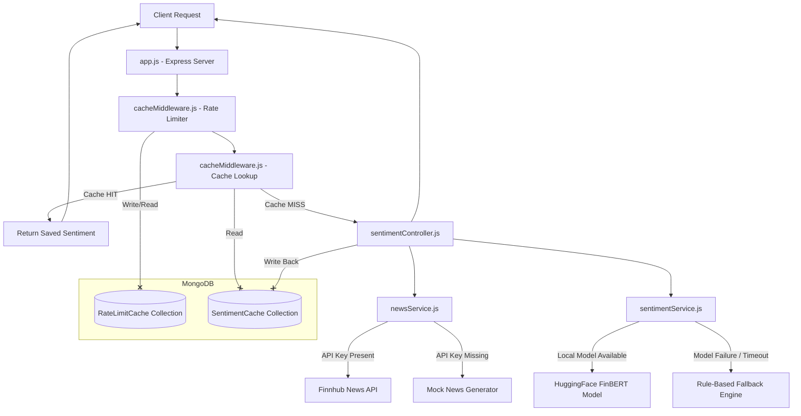

# Project Architecture & Database Specification

This document provides a technical breakdown of the **Dockerized Stock Sentiment API** project, including system architecture, database design, caching strategy, and the current operational state.

---

## 1. Context & Objectives
This project is designed as a production-grade, self-contained microservice for a FinTech environment. In algorithmic trading or automated news monitoring, three primary constraints exist:
1. **Network Latency / Rate Limits**: Financial news APIs (like Finnhub) enforce strict daily/minute rate limits. 
2. **Computational Overhead**: AI inference using Natural Language Processing (NLP) models is CPU/GPU intensive. Repeating inference on the same headlines wastes server resources.
3. **High Availability**: If the caching layer (MongoDB) fails, the core API must not crash; it should seamlessly degrade to live calculation.

---

## 2. System Architecture

The project follows a **Layered Architecture** with high separation of concerns:

---

## 3. Database Schema & Caching Strategy

The database acts as the **state management engine** for API limits and sentiment cache. It uses two collection schemas defined in `src/models/cacheModel.js` and managed via Mongoose.

### A. Sentiment Cache Collection (`sentimentcaches`)
Stores the computed sentiment results for a ticker symbol to bypass subsequent news fetching and AI inference.

| Field Name | Type | Index Details | Description |
| :--- | :--- | :--- | :--- |
| `symbol` | `String` | Unique, Uppercase, Index | The stock ticker (e.g., `AAPL`) |
| `articlesCount` | `Number` | None | Total news articles processed |
| `sentimentSummary` | `Object` | None | Aggregated ratios: `overallSentiment`, percentages, and average score |
| `articles` | `Array` | None | Array of articles annotated with sentiment labels and confidence scores |
| `createdAt` | `Date` | **TTL Index (3600s)** | Timestamp of creation. Automatically deleted by MongoDB after 1 hour |

#### Caching Mechanism
- **Expiration Policy (1-Hour TTL)**: The `expires: 3600` option on `createdAt` leverages MongoDB's background thread (which runs every 60 seconds) to automatically purge cache documents older than 1 hour. This ensures the API periodically serves fresh news without manual cron jobs.
- **Write-Through Caching**: Writing to cache in `sentimentController.js` is done asynchronously (`SentimentCache.create(...).catch(...)`) to prevent blocking the client's HTTP response.

### B. Rate Limiting Collection (`ratelimitcaches`)
Tracks the request counts from unique IP addresses to enforce API consumption thresholds.

| Field Name | Type | Index Details | Description |
| :--- | :--- | :--- | :--- |
| `ip` | `String` | Unique, Index | Client IP Address |
| `count` | `Number` | None | Number of requests in the current window (Defaults to `1`) |
| `expiresAt` | `Date` | **TTL Index (expireAfterSeconds: 0)** | Expire date. Automatically deleted once `expiresAt` is reached |

#### Rate-Limiting Mechanism
- **Dynamic TTL**: The document is configured to expire at the precise timestamp stored in `expiresAt` (configured for 1 minute from the initial request). Once the record is deleted by MongoDB, the client's limit resets automatically.

---

## 4. Operational & Connectivity State

### Current State
1. **Database Mode (Local Host)**: The database is configured to connect to `mongodb://localhost:27017/stock_sentiment`. If run on the host machine without a running MongoDB database:
   - The connection timeout triggers after **5 seconds** (`serverSelectionTimeoutMS: 5000`).
   - The app gracefully prints `MongoDB connection failed... Application will run in DEGRADED MODE`.
   - All client queries bypass `rateLimiterMiddleware` and `checkSentimentCache`, proceeding directly to news gathering and AI inference.
2. **Database Mode (Docker)**: When launched via `docker-compose.yml`, the environment variable `MONGODB_URI` points to the `mongodb` service container.
   - The database server starts up.
   - The API container waits for the MongoDB container health check to pass before starting (`depends_on.condition: service_healthy`).
   - Full caching and rate-limiting operations are immediately active.

---

## 5. Architectural Design Highlights (For Interview Panel)

- **Degraded Mode Resilience**: Employs connection failure trapping to allow the API to operate in a non-caching mode if MongoDB goes offline. 
- **Local AI execution via ONNX runtime**: Uses `@xenova/transformers` to run Hugging Face pipelines inside Node.js. This allows developers to run inference on commodity CPUs (such as an interview laptop) without needing expensive GPU resources or paying for external Hugging Face inference tokens.
- **Multi-Stage Docker Design**: Prevents leaking compilation tooling and devDependencies into the production image, minimizing container image size.
- **Named Docker Volume Mounts**: Binds the local host machine folder to the Docker container cache path `/app/.cache`. The Hugging Face model only downloads once; container updates do not trigger redownloads.
